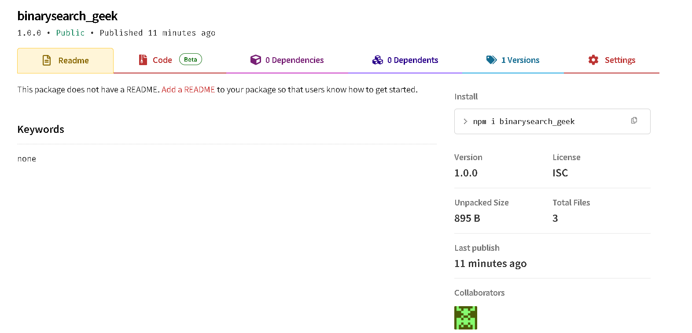

# 🔍 Binary Search - Geekster CW3

This project contains a simple and efficient implementation of the **Binary Search algorithm** in JavaScript.  
It was created as part of **Geekster Module 6 (Node.js)** – CW3 assignment.

---

## 📸 Package Upload Screenshot

Here’s the screenshot of successful npm publish:



---

## 📁 Project Structure


cw3/
├── assets/                 → Assets folder
│   └── packageUploaded.png  → Screenshot of successful npm publish
├── binarysearch_geek/      → Main NPM package folder
│   ├── index.js            → Binary Search logic
│   ├── package.json        → NPM configuration
│   └── test.js             → Sample usage test
│   
└── README.md           → Project documentation (this file)


---

## 📦 Package Details

- **Package Name:** `binarysearch_geek`
- **Version:** 1.0.0
- **Published To:** [npmjs.com/package/binarysearch_geek](https://www.npmjs.com/package/binarysearch_geek)
- **Author:** Ayush Kohre
- **Category:** Algorithm (Search)

---

## ✅ Features

- Simple and readable code
- Efficient binary search logic
- Easily reusable as an npm module

---

## 💻 Installation & Usage

### ➤ Install using npm

```bash
npm install binarysearch_geek
````

### ➤ Example

```js
const binarySearch = require('binarysearch_geek');

const arr = [1, 3, 5, 7, 9];
const target = 7;

console.log(binarySearch(arr, target));  // Output: 3
```

---

## 🧪 Test Output

To test manually, run:

```bash
node test.js
```

---

## 🔗 Links

* [👉 View on NPM](https://www.npmjs.com/package/binarysearch_geek)
* [📁 GitHub Repository](https://github.com/your-github-username/binarysearch_geek)

---

## 📌 License

This project is open-source and free to use under the [MIT License](https://opensource.org/licenses/MIT).

---

> 💡 *Built ❤️ by Ayush Kohre as part of Geekster CW3 Assignment.*

