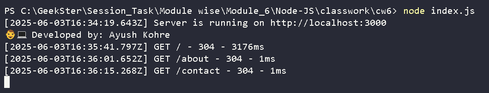

# 🧩 Simple Logging Middleware (Express.js)

This project demonstrates how to build and integrate a **custom logging middleware** in an Express.js backend application. The middleware captures and logs essential information for each incoming HTTP request, helping developers monitor performance, debug efficiently, and maintain visibility over request-response cycles.

---

### 📌 Overview

* **Logging Middleware:**
  Intercepts each request and logs:

  * HTTP method
  * Requested URL
  * Timestamp (ISO format)
  * HTTP response status code
  * Time taken to process the request (in milliseconds)

* **Routing:**

  * `GET /` → Home Page
  * `GET /about` → About Page
  * `GET /contact` → Contact Page

* **Privacy:**
  No sensitive data (e.g., IP addresses) is logged, ensuring the project is safe for public sharing and respects privacy.

---

### 🖥️ Output - ScreenShot


---

### 🧠 Purpose

This backend Node.js project is part of my learning journey through the **Geekster Node.js Program (Module 6)**. It showcases my understanding of:

* Middleware in Express.js
* Request lifecycle
* Node.js logging best practices

---

### 🛠️ Tech Stack

* **Node.js**
* **Express.js**

---

### 📂 Folder Structure

```

project-root/
│
├── Assets/
│   └── outputImg.png       # Output screenshot or image
│
├── middleware/             
│   └── logger.js           # Custom logging middleware
│
├── node_modules/           # Installed node dependencies (auto-generated)
├── index.js                # Main entry point of the Express app
├── package-lock.json       # Dependency tree lockfile
├── package.json            # Project metadata and dependencies
│
└── README.md               # Project documentation

```

---

### ⚙️ Installation & Setup

1. **Clone the repository:**

   ```bash
   git clone <your-repository-url>
   cd <your-repository-name>
   ```

2. **Install dependencies:**

   ```bash
   npm install
   ```

3. **Run the server:**

   ```bash
   node index.js
   ```

4. **Access the endpoints in your browser or Postman:**

   * Home: [http://localhost:3000/](http://localhost:3000/)
   * About: [http://localhost:3000/about](http://localhost:3000/about)
   * Contact: [http://localhost:3000/contact](http://localhost:3000/contact)

---

### 🧾 Sample Log Output

```
[2025-06-02T12:00:01.123Z] GET /about - 200 - 2ms
[2025-06-02T12:00:04.567Z] GET /contact - 200 - 1ms
```

---

### 👨‍💻 Developer

**Ayush Kohre**
Backend Developer (in training)

---

### ✅ Notes

* IP addresses and other sensitive data are intentionally **not logged** to ensure privacy and compliance.
* This project is a new and standalone task focusing on middleware logging in Express.js.

---
