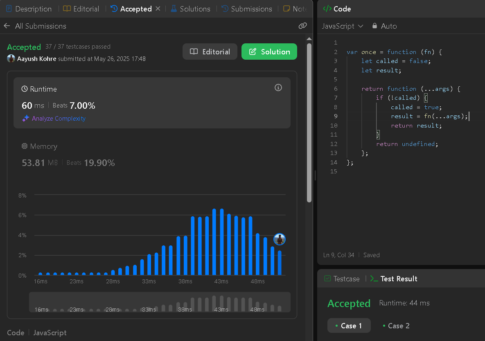
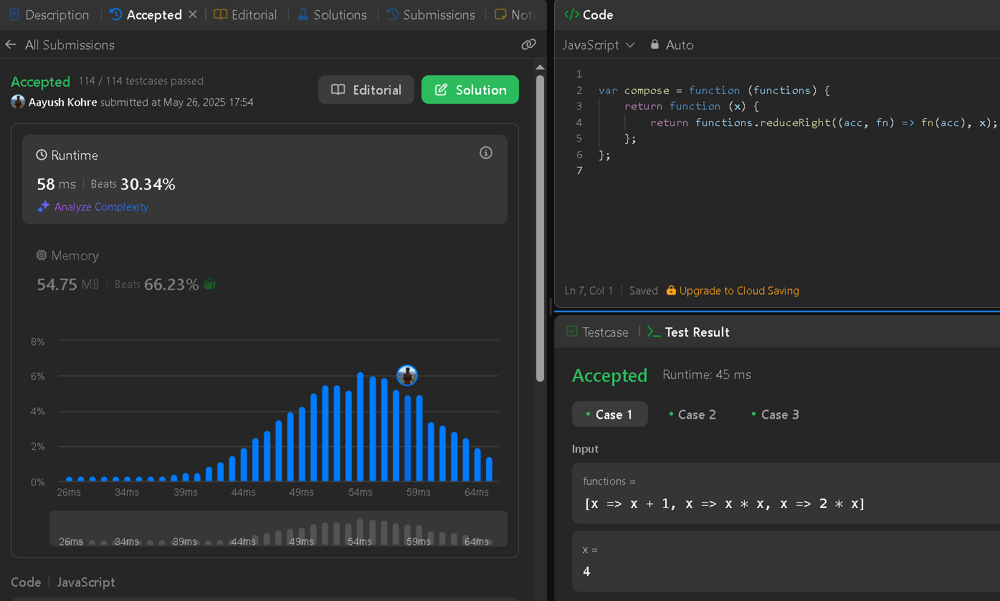
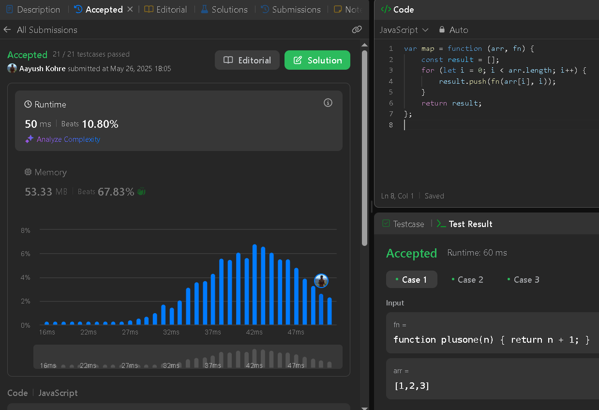
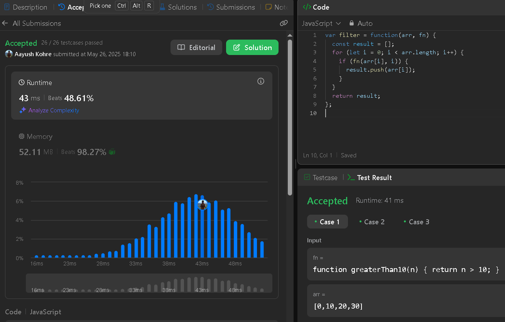
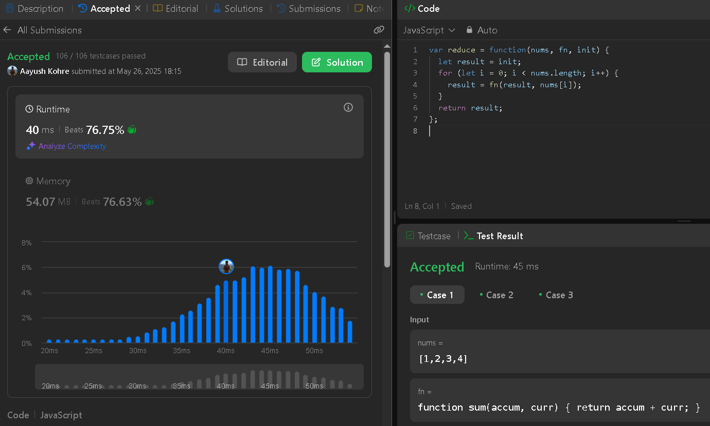

## HOMEWORK : Leetcode Problem

[My LeetCode ID](https://leetcode.com/u/kohreaayush/)

--------

### 1: 2666 - Allow One Function Call

### 2: 2629. Function Composition

### 3: 2635. Apply Transform Over Each Element in Array

### 4: 2634. Filter Elements from Array

### 5: 2626. Array Reduce Transformation

