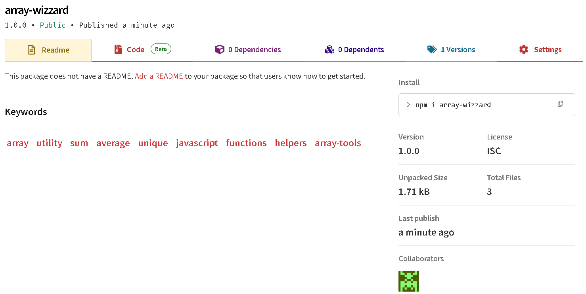

# 🧙‍♂️ Array Wizard - Geekster HW3

This project is a handy utility library called **Array Wizard**, offering custom helper functions for array manipulation like `sum`, `average`, `unique`, and more.

It was created as part of **Geekster Module 6 (Node.js)** – HW3 assignment.

---

## 📸 Package Upload Screenshot

Here’s the screenshot of successful npm publish:



---

## 📁 Project Structure

```
HW3/
├── array-wizzard/          → Main NPM package folder
│   ├── index.js            → Array utility functions
│   ├── package.json        → NPM configuration
│   └── test.js             → Sample usage test
├── Assets/                 → Assets folder
│   └── packageUploaded.png → Screenshot of successful npm publish
│
└── README.md               → Project documentation (this file)
```

---

## 📦 Package Details

* **Package Name:** `array-wizzard`
* **Version:** 1.0.0
* **Published To:** [npmjs.com/package/array-wizzard](https://www.npmjs.com/package/array-wizzard)
* **Author:** Ash (Ayush Kohre)
* **License:** ISC
* **Keywords:** array, utility, javascript, helpers, geekster

---

## 🚀 Features

* `sum(arr)` – Returns the sum of all numeric elements
* `average(arr)` – Calculates the average
* `unique(arr)` – Removes duplicates
* `groupBy(arr, callback)` – Groups items by callback key
* `chunk(arr, size)` – Breaks array into chunks
* `flatten(arr)` – Flattens nested arrays
* `countBy(arr, callback)` – Groups with counts
* `removeFalsy(arr)` – Removes falsy values
* `max(arr)` – Returns the max number
* `min(arr)` – Returns the min number

---

## 🧪 Usage

```js
const wizard = require("array-wizzard");

console.log(wizard.sum([1, 2, 3])); // 6
console.log(wizard.unique([1, 1, 2, 3])); // [1, 2, 3]
```

---

## 🔗 Links

* [👉 View on NPM](https://www.npmjs.com/package/array-wizzard)
* [📁 GitHub Repository](https://github.com/Ash-dot-coder/Geekster_Task/tree/main/Module_6/Node-JS/HomeWork/HW3/array-wizzard)

---

## 📌 License

This project is open-source and free to use under the [ISC License](https://opensource.org/license/isc-license-txt).

---

> 💡 *Built ❤️ by Ayush Kohre as part of Geekster HW3 Assignment.*
