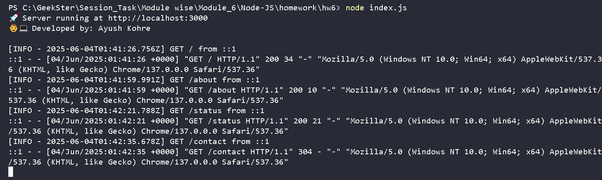

# 🧩 Request Logging Middleware App (Express.js)

This project demonstrates the use of a **custom logging middleware** in an Express.js application, combined with the popular **Morgan logger**. The middleware captures essential request details and logs them to the console in real time. It’s a great foundational project to understand middleware behavior and HTTP request tracking in Node.js.

---

## 🔍 Overview

### ✅ **What This Project Does:**

* Captures and logs:

  * HTTP Method
  * Request URL
  * IP Address
  * Timestamp in ISO format
* Uses a **custom logger** middleware (`requestLogger.js`)
* Integrates **Morgan** middleware for advanced logging format
* Provides simple routes to test middleware

---

## 🧠 Learning Outcomes

As part of the **Geekster Node.js Program (Module 6)**, this project demonstrates my understanding of:

* Express.js middleware fundamentals
* Request lifecycle handling
* Logging using custom and third-party tools
* Clean project structure in Node.js

---

## 🌐 Routes Available

| Method | Route      | Description   |
| ------ | ---------- | ------------  |
| GET    | `/`        | Home Page     |
| GET    | `/about`   | About Page    |
| GET    | `/status`  | Status Page   |
| GET    | `/contact` | Contact Page  |

*You can add more routes as needed to test further.*

---

## 🖥️ Sample Log Output

```
[INFO - 2025-06-02T12:00:01.123Z] GET / from ::1
::1 - - [02/Jun/2025:12:00:01 +0000] "GET / HTTP/1.1" 200 - "-" "PostmanRuntime/7.32.0"
```

> 💡 First line = custom logger
> 💡 Second line = Morgan logger (combined format)

---

## 📦 Tech Stack

* **Node.js**
* **Express.js**
* **Morgan** (for HTTP request logging)
* **Custom Middleware** (for learning purpose)

---

## 🗂️ Project Structure

```
request-logger-app/
│
├── Assets/
│   └── OP_ConsoleNameTime.png # Screenshot of log output
│
├── middleware/
│   └── requestLogger.js       # Custom logging middleware
│
├── .gitignore                 # Specifies untracked files to ignore in Git
├── index.js                   # Main entry point
├── package-lock.json          # Dependency lock file
├── package.json               # Dependencies & metadata
└── README.md                  # Project documentation
```

---

## 📸 Console Output Preview



---

## ⚙️ Setup & Usage

### 1. Clone the repository

```bash
git clone https://github.com/ash-dot-coder/request-logger-app.git
cd request-logger-app
```

### 2. Install dependencies

```bash
npm install
```

### 3. Run the server

```bash
node index.js
```

### 4. Test routes

Open your browser or Postman:

* [http://localhost:3000/](http://localhost:3000/) → Home
* [http://localhost:3000/about](http://localhost:3000/about) → About
* [http://localhost:3000/status](http://localhost:3000/status) → Status
* [http://localhost:3000/contact](http://localhost:3000/contact) → Contact

---

## 🚧 Privacy Note

This project logs **non-sensitive request metadata** including:

* HTTP method
* Request path
* IP address (via `req.ip`)
* Timestamp

🔐 **Important:**
While the client IP address is logged, it's solely for learning/demo purposes and **not stored, analyzed, or used for any tracking**. No personal data, request bodies, or headers are logged.

---

## 👨‍💻 Author

**Ayush Kohre**
* 🚀 Back-end Developer (in training)
* 🔗 [GitHub](https://github.com/ash-dot-coder)
* 💡 Passionate about clean code, middleware, and learning backend systems.

---

## 📘 Additional Notes

* You can extend this middleware to log:

  * Status codes
  * Response time
  * Request headers
* Optionally, consider integrating [Winston](https://www.npmjs.com/package/winston) or [Log4js](https://www.npmjs.com/package/log4js) for production-level logging.

---
